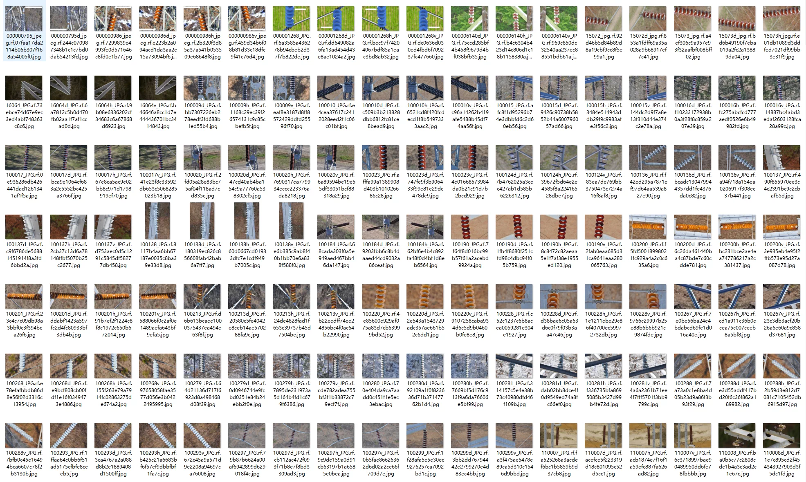
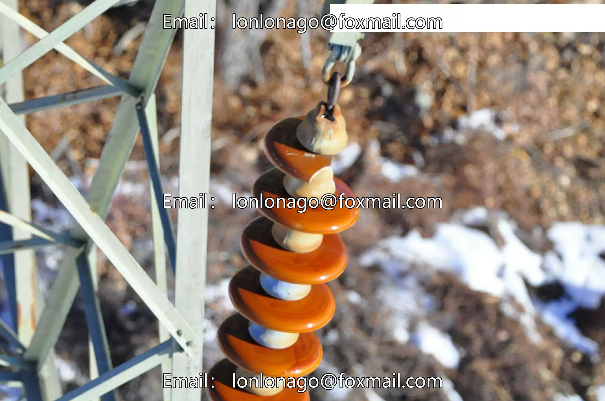
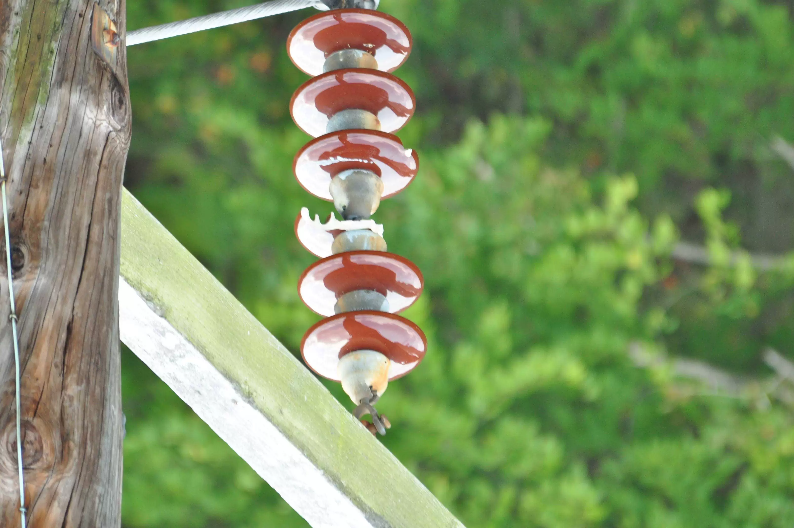
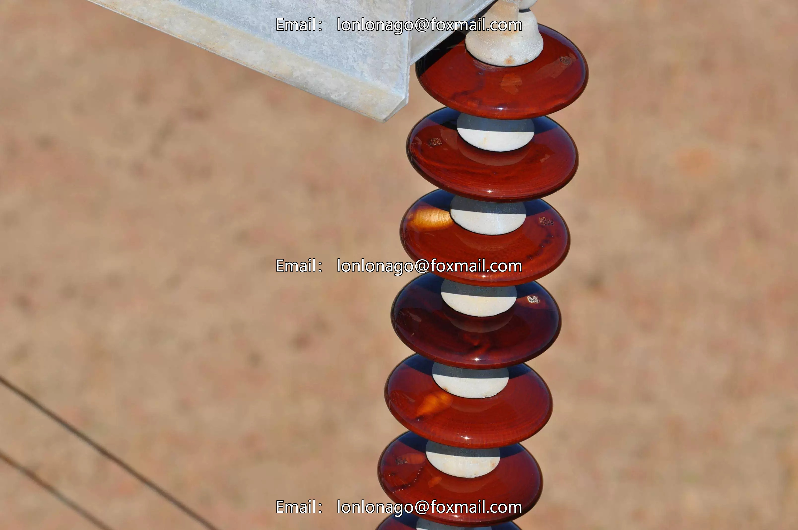
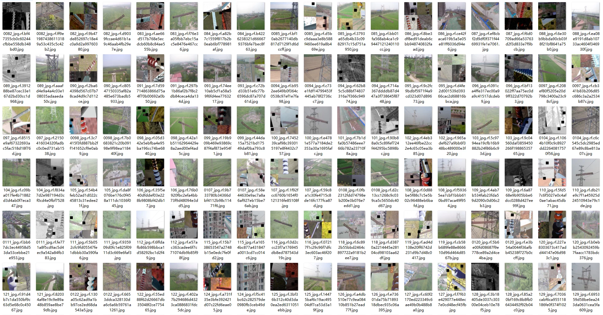
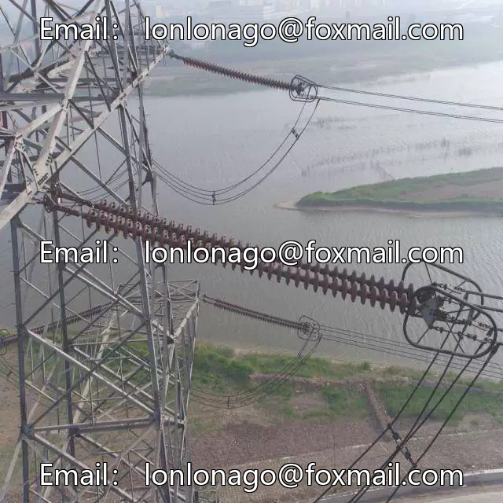
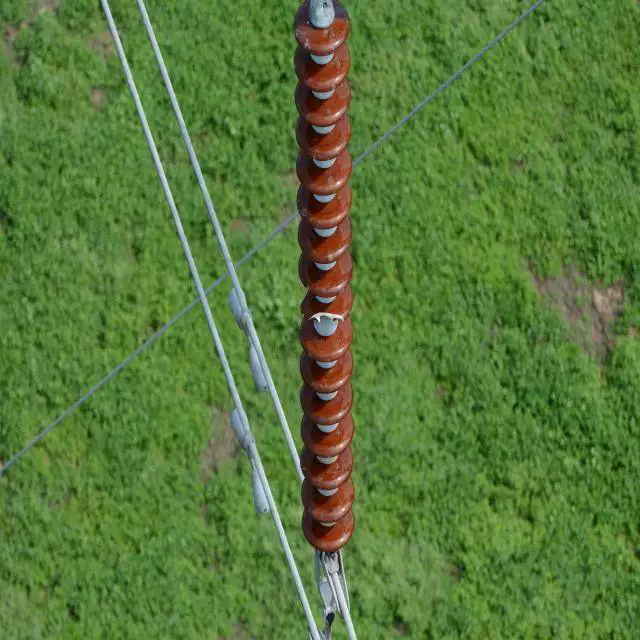
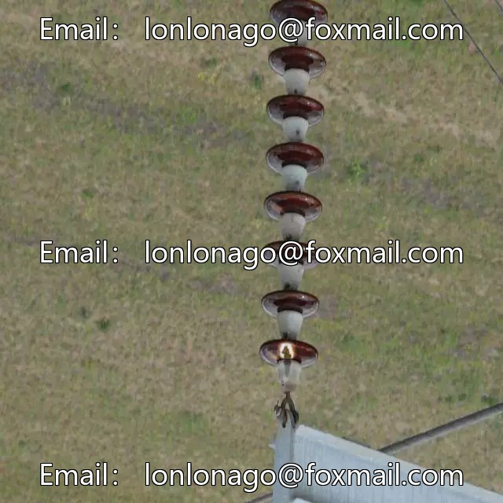
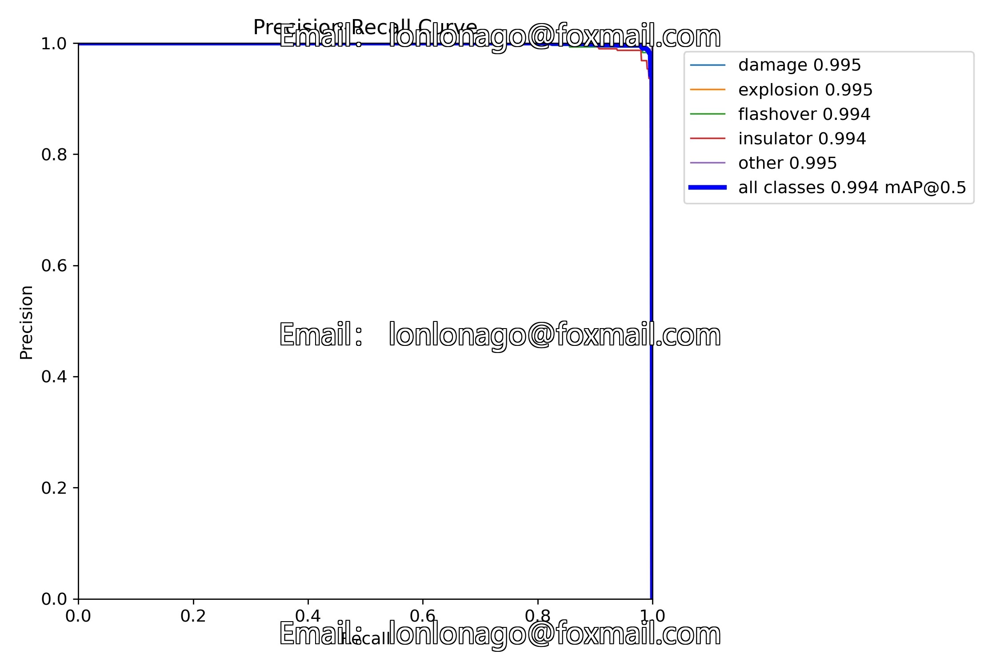

## Body

（IDID数据集）绝缘子缺陷目标检测数据集 YOLO格式

IDID数据集：绝缘子缺陷图像数据集 YOLO格式
划分好训练集，验证集
一个1600张图片，训练集：1440张图片  验证集：160张图片
一共5个类别：damage', 'flashover', 'good', 'insulator', 'other

融合数据集：绝缘子缺陷图像数据集 YOLO格式
划分好训练集，测试集，验证集
一个4604张图片，训练集：4318张图片  测试集：42张图片   验证集：244张图片
一共5个类别：damage', 'explosion', 'flashover', 'insulator', 'other
融合数据集有数据增强

权重文件是使用融合数据集训练所得
YOLOv8权重文件（训练轮数100，预训练模型YOLOv8m.pt，mAP@50 0.994）
YOLOv11权重文件（训练轮数100，预训练模型YOLO11m.pt，mAP@50 0.994）

电子虚拟产品售出概不退换

## Images

Here is a pay link on Stripe ( https://buy.stripe.com/3cs8yP7sY87d0vu9AB ). Please contact me lonlonago@foxmail.com after funding $89, and I will send you a complete data files , thank you!

